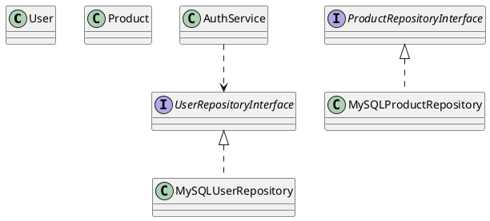
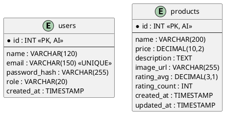
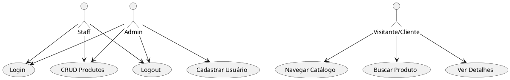
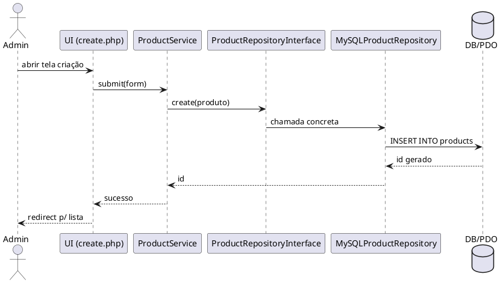

# 📦 Módulo E-commerce (Roupas Gamer)

Este projeto implementa um **módulo funcional de e-commerce** focado em roupas gamer.  
O objetivo principal não é entregar um sistema completo, mas sim **demonstrar a aplicação prática de engenharia de software**: modelagem UML, princípios SOLID, padrões de projeto e persistência de dados em banco relacional.

---

## 🎯 Escopo do Módulo
- **Sistema de Login** (autenticação com hash seguro de senha).
- **CRUD de Produtos** (Create, Read, Update, Delete).
- **Catálogo Público** (cards, busca e modal de detalhes).
- **Cadastro de Usuários** (restrito a Admin).
- Persistência em **MySQL** via PDO.

---

## 🛠️ Tecnologias
- **PHP 8+**
- **MySQL / MariaDB**
- **HTML5 + CSS/Bootstrap**

---

## 🧩 Padrões e Princípios
- **DIP (Dependency Inversion Principle):**  
  Services dependem de interfaces de repositório, não de implementações concretas.
- **Strategy:**  
  Interface `PasswordHasherInterface` com implementações `BcryptHasher` e `Argon2Hasher`.
- **Factory/DI (Injeção de Dependência):**  
  `Container` centraliza criação e injeção de dependências.
- **Singleton:**  
  `Database::getConnection()` garante uma única instância PDO reutilizável.
- **Segurança:**  
  Tokens CSRF em formulários e uso de `password_hash`/`password_verify`.

---

## 📊 Modelagem UML

### 🔹 Diagrama de Classes
Mostra entidades (`User`, `Product`), interfaces de repositório, implementações, serviços, hasher (Strategy), container (Factory/DI) e conexão Singleton.


### 🔹 Diagrama ER (Persistência)
Estrutura de banco relacional focada no escopo do módulo.


### 🔹 Diagrama de Casos de Uso
Atores: **Admin**, **Staff**, **Visitante/Cliente**.  
Admin: login, CRUD, cadastrar usuários, logout.  
Staff: login, CRUD, logout.  
Visitante: navegar catálogo, buscar produto, ver detalhes.


### 🔹 Diagrama de Sequência (Fluxo: Admin cadastra produto)
Mostra interação entre Admin, UI, Service, Repositório e Banco.


---

## 📹 Sugestão de Apresentação
- **1 min:** Interface (login, dashboard, CRUD, catálogo).  
- **1 min:** Diagramas ER + Classes.  
- **2 min:** Código e padrões aplicados (Database Singleton, Strategy de senha, Container DI, DIP).  
- **1 min:** Considerações finais, melhorias futuras.

---

## 📂 Estrutura Recomendada
```
commerce-module/
 ├── public/         # arquivos acessados pelo navegador (index.php, login.php, etc.)
 ├── src/            # classes (Domain, Service, Repository, Config, Http)
 ├── database/       # schema.sql e seed.sql
 ├── docs/           # diagramas PlantUML e imagens exportadas
 └── README.md
```

---

## ✅ Status
✔️ Login funcional  
✔️ CRUD de produtos  
✔️ Catálogo público  
✔️ Cadastro de usuários (somente Admin)  
✔️ Modelagem UML concluída (Classes, ER, Casos de Uso, Sequência)  

---
